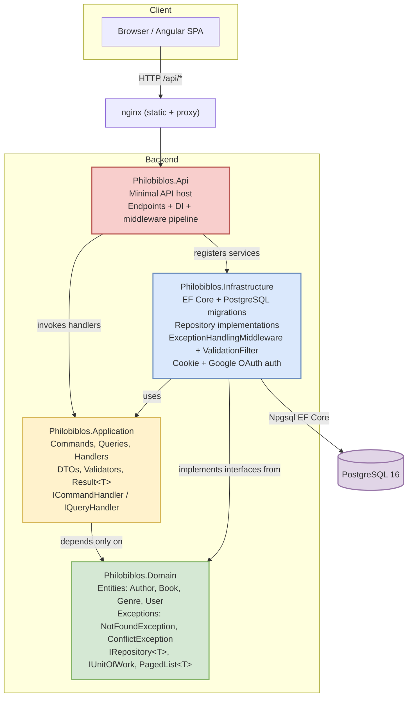

# Philobiblos

A small but production-aware library management system for a Senior Software Engineer technical challenge. It manages **genres**, **authors**, and **books** with case-insensitive uniqueness, delete protection, ISBN validation, and a uniform HTTP error contract.

## Solution overview

- **Backend:** .NET 10 minimal-API application (`backend/src/Philobiblos.Api/`)
- **Frontend:** Angular 19 standalone SPA (`frontend/`)
- **Database:** PostgreSQL 16
- **Observability:** Serilog structured logging with correlation IDs, OpenTelemetry traces, Prometheus metrics, and health checks
- **Run orchestration:** Docker Compose (`docker-compose.yml`)

The repository is intentionally small (three entities, CRUD use cases) so the focus is on justified architecture, a coherent API contract, and a clean local run experience.

## Prerequisites

- [.NET 10 SDK](https://dotnet.microsoft.com/download)
- [Node.js 22](https://nodejs.org/)
- [Docker](https://www.docker.com/) & Docker Compose
- Angular CLI (optional): `npm install -g @angular/cli`

## Quick start

### One-command full stack

```bash
docker compose up --build
```

Services come up as:

| Service | URL / Port | Notes |
|---|---|---|
| PostgreSQL | `localhost:5432` | Database `philobiblos` |
| API | `http://localhost:8080` | Migrations auto-apply in Development |
| Web | `http://localhost:4200` | Angular SPA served by nginx |
| OpenTelemetry Collector | `localhost:4317` (gRPC), `localhost:4318` (HTTP) | Receives OTLP traces and metrics from the API |
| Prometheus | `http://localhost:9090` | Scrapes metrics from the collector |
| Jaeger | `http://localhost:16686` | Trace search and visualization UI |

Tear down and remove the volume:

```bash
docker compose down -v
```

### Observability

The API exposes two anonymous, production-friendly endpoints:

- `GET /health` — database health check (no authentication required).
- `GET /metrics` — Prometheus exposition format with HTTP and runtime metrics.

When running via Docker Compose, the API sends traces and metrics via OTLP to the OpenTelemetry Collector:

- `OTEL_EXPORTER_OTLP_ENDPOINT=http://otel-collector:4317`
- Traces are forwarded to **Jaeger** (`http://localhost:16686`).
- Metrics are re-exposed by the collector and scraped by **Prometheus** (`http://localhost:9090`).

For `dotnet run` without Docker, the app still serves `/health` and `/metrics`, but no collector, Prometheus, or Jaeger services are started.

### Backend only

```bash
cd backend
dotnet run --project src/Philobiblos.Api/Philobiblos.Api.csproj
```

Requires a PostgreSQL instance on `localhost:5432` matching `appsettings.json` (`Database=philobiblos;Username=postgres;Password=postgres`). Migrations auto-apply in Development.

### Frontend only

```bash
cd frontend
npm install
npm run start
```

`ng serve` runs on `http://localhost:4200` and proxies `/api` requests to `http://localhost:8080` via `proxy.conf.json`.

## Architecture

The backend uses **Clean Architecture** with an explicit repository pattern:

- **`Domain`** — entities, domain exceptions, repository interfaces, and shared paging primitives. No framework dependencies.
- **`Application`** — commands, queries, handlers, DTOs, validators, result types, and handler abstractions. Depends only on `Domain`.
- **`Infrastructure`** — EF Core, PostgreSQL migrations, repository implementations, exception middleware, and validation filter. Depends on `Domain` and `Application`.
- **`Api`** — thin minimal-API host that maps endpoints, registers DI, and delegates to application handlers.

The frontend uses **feature folders** plus a thin `core/` layer for HTTP and error handling. Component state uses Angular signals; HTTP streams are mapped into signals at the component boundary.

## Diagram



## Dependency rule

Dependencies point inward:

- `Philobiblos.Domain` has no project dependencies.
- `Philobiblos.Application` depends only on `Philobiblos.Domain`.
- `Philobiblos.Infrastructure` depends on `Philobiblos.Domain` and `Philobiblos.Application`.
- `Philobiblos.Api` depends on `Philobiblos.Application` and `Philobiblos.Infrastructure` (for DI registration only).


## Backend organization

```
backend/src/
├── Philobiblos.Domain/
│   ├── Entities/          Author.cs, Book.cs, Genre.cs, User.cs
│   ├── Exceptions/        NotFoundException.cs, ConflictException.cs
│   ├── Repositories/      IRepository.cs (with IAuthorRepository, IBookRepository, IGenreRepository, IUserRepository, IUnitOfWork)
│   ├── Security/          ICurrentUser.cs
│   └── Common/            PagedList.cs
├── Philobiblos.Application/
│   ├── Authors/           Commands, Queries, DTOs (validators live inside command files)
│   ├── Books/
│   ├── Genres/
│   └── Common/            Result.cs, Unit.cs, PagedQuery.cs, IHandler.cs (ICommandHandler / IQueryHandler)
├── Philobiblos.Infrastructure/
│   ├── Data/              LibraryDbContext.cs, configurations, migrations
│   ├── Repositories/      Repository.cs, AuthorRepository.cs, BookRepository.cs, GenreRepository.cs, UserRepository.cs
│   ├── Security/          AuthOptions.cs, HttpContextCurrentUser.cs
│   ├── Observability/     OpenTelemetry + health-check registration
│   ├── Middleware/        ExceptionHandlingMiddleware.cs
│   ├── Filters/           ValidationFilter.cs
│   └── Paging/            PagingExtensions.cs
└── Philobiblos.Api/
    ├── Endpoints/         AuthEndpoints.cs, AuthorEndpoints.cs, BookEndpoints.cs, GenreEndpoints.cs
    └── Program.cs         DI registration and middleware pipeline
```

- **No MediatR.** Handlers are invoked directly through a simple `ICommandHandler<TCommand,TResult>` / `IQueryHandler<TQuery,TResult>` abstraction.
- **Repository pattern.** EF Core and raw SQL are isolated in the infrastructure layer; the application layer depends on interfaces defined in the domain.
- **Preserved HTTP contract.** Routes, status codes, and ProblemDetails shapes remain unchanged from the previous vertical-slice implementation.

## Frontend organization

```
frontend/src/app/
├── core/
│   ├── api.service.ts                Typed HTTP client for all entities
│   ├── auth.service.ts               Current user signal, login/logout helpers
│   ├── auth.interceptor.ts           Redirects to login on 401, shows banner on 403
│   ├── problem-details.interceptor.ts Maps 400 field errors to forms, 409/404/500 to messages
│   ├── error.service.ts              Reactive error banner state
│   └── models.ts                     Shared DTOs, `PagedResult<T>`, and `User`
├── features/
│   ├── login/          login.component
│   ├── genres/         genre-list.component
│   ├── authors/        author-list.component
│   └── books/          book-list.component
├── shared/
│   └── components/
│       └── pagination.component
└── app.routes.ts
```

- Reactive forms for create/edit with server validation errors written back onto controls.
- A single HTTP interceptor normalizes every backend error into one `ApiError` shape.
- No NgRx store; component-level signals are sufficient for this scope.

## Database choice

PostgreSQL 16 is used via the Npgsql EF Core provider.

- Case-insensitive uniqueness for genre/author names via function-based indexes on `lower("Name")`.
- Optional ISBN uniqueness via a filtered unique index on `Books.Isbn` where `Isbn IS NOT NULL`.
- Foreign keys from `Books` to `Authors` and `Genres` use `Restrict` delete behavior; the application pre-checks references and returns `409 Conflict` when deletion would leave orphans.

## Main trade-offs

Key decisions are captured in ADRs under `docs/adr/`:

1. **Clean Architecture with repository pattern** — explicit layers isolate domain logic from EF Core, making the code easier to unit-test and evolve as the domain grows. See [ADR 0005](docs/adr/0005-clean-architecture-repository-pattern.md).
2. **PostgreSQL over SQL Server/MySQL** — fast container startup, first-class Npgsql provider, no licensing. See [ADR 0002](docs/adr/0002-postgresql.md).
3. **No MediatR / simple handler abstractions** — `ICommandHandler` and `IQueryHandler` provide just enough indirection without the ceremony of a full message bus. Covered by [ADR 0005](docs/adr/0005-clean-architecture-repository-pattern.md).
4. **ProblemDetails + global middleware + FluentValidation filter** — uniform error contract, no stack-trace leakage, correlation IDs. See [ADR 0004](docs/adr/0004-error-contract.md).
5. **OAuth 2.0 with Google plus cookie sessions** — delegates credential management to Google, avoids storing passwords, and uses policy-based RBAC. See [ADR 0006](docs/adr/0006-oauth-authentication-with-google.md).
6. **OpenTelemetry observability** — traces, runtime metrics, and health checks are collected through the OpenTelemetry SDK and exported via OTLP to a local collector that feeds Jaeger and Prometheus. See [ADR 0007](docs/adr/0007-opentelemetry-observability.md).

## Testing strategy

- **Unit tests** (`backend/tests/Philobiblos.UnitTests/`): validator rules, ISBN checksum logic, pagination bounds, and business-rule branches that do not depend on real persistence.
- **Integration tests** (`backend/tests/Philobiblos.IntegrationTests/`): `WebApplicationFactory` + Testcontainers PostgreSQL. Each scenario hits the real HTTP boundary with real migrations and persistence, including 400/404/409 shapes, pagination metadata, and sort whitelist rejection.
- **End-to-end tests** (`frontend/e2e/`): Playwright tests against the full Docker Compose stack. They verify the Angular SPA: navigation, loading/empty states, search and pagination, create/edit/delete forms, server error mapping, book relationship visibility, and API error handling.

Run all backend tests:

```bash
cd backend
dotnet test
```

> Docker is required for integration tests. To run only unit tests: `dotnet test --filter FullyQualifiedName~UnitTests`

Run the full e2e suite (builds and starts the stack, runs Playwright, tears down):

```bash
cd frontend
npm run test:e2e:ci
```

To run e2e tests against an already-running stack:

```bash
cd frontend
npm run test:e2e
```

## Authentication

The backend supports Google OAuth 2.0 when enabled. `Auth:Google:Enabled` is the switch: set it to `true` to enable the Google OAuth flow, or `false` to keep it disabled (no Google credentials required). The default `AuthenticationScheme` is `Google` and only needs to be changed if you register multiple OAuth providers.

Configure these settings via `appsettings.json`, `appsettings.Development.json`, or environment variables:

```json
{
  "Auth": {
    "SeedAdminEmail": "admin@example.com",
    "Google": {
      "Enabled": true,
      "AuthenticationScheme": "Google",
      "ClientId": "<your-google-client-id>",
      "ClientSecret": "<your-google-client-secret>"
    },
    "Cookie": {
      "ExpireTimeSpan": "14.00:00:00",
      "SlidingExpiration": true
    }
  }
}
```

For environment variables, ASP.NET Core flattens the `:` hierarchy into double underscores (`__`). Examples:

- `Auth__Google__Enabled=true`
- `Auth__Google__ClientId=<your-google-client-id>`
- `Auth__Google__ClientSecret=<your-google-client-secret>`
- `Auth__SeedAdminEmail=admin@example.com`

To enable real Google OAuth in Docker Compose, add the credentials under the `api` service:

```yaml
api:
  environment:
    Auth__Google__Enabled: "true"
    Auth__Google__ClientId: "<your-google-client-id>"
    Auth__Google__ClientSecret: "<your-google-client-secret>"
    Auth__SeedAdminEmail: "admin@example.com"
```

### Local development and e2e tests without Google credentials

Enable the test login endpoint for a deterministic, credential-free session:

```json
{
  "Auth": {
    "Test": {
      "Enabled": true,
      "Email": "test@example.com",
      "DisplayName": "Test User",
      "Roles": ["Editor"]
    }
  }
}
```

Environment variable: `Auth__Test__Enabled=true`.

`POST /api/auth/test-login` is only available in non-Production environments and issues an authenticated cookie for the configured test user. The default `docker-compose.yml` ships with this enabled for e2e tests.

## Known limitations

- No audit logging or audit columns.
- No soft deletes; records are physically removed.
- Role claims are captured at sign-in; a role change requires signing out and back in to refresh.
- No CI pipeline or deployment target beyond Docker Compose.

## Improvements with more time

- Additional OAuth providers (Microsoft, GitHub) behind a small external-identity abstraction.
- Refresh role claims without forcing a full sign-out.
- Audit columns (`CreatedAt`, `CreatedBy`, `UpdatedAt`, `UpdatedBy`).
- Soft deletes and a recycle-bin workflow.
- CI pipeline (build, test, container image publish).
- Richer Angular filtering/sorting (multi-column, debounced search).
- A React alternative version of the SPA for comparison, or Storybook for component documentation.
